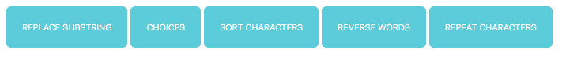

# soc-week-3-project
> Starter Code exercises to practice javascript coding and learn how to model the listener, handler and logic of the javascript code of webpages, some exercises on how to perform if decision control and for loop for arrays.

## Table of contents
* [General info](#general-info)
* [Screenshots](#screenshots)
* [Technologies](#technologies)
* [Setup](#setup)
* [Features](#features)
* [Status](#status)
* [Inspiration](#inspiration)
* [Contact](#contact)

## General info
The purpose of the project is to continue learning and using javascript on webpages, use of the flow control structures, loops and data structures of javascript.

## Screenshots

## Technologies
* HTML5
* CSS3
* git
* javascript

## Setup
You can clone or fork this repository and test the files.

## Features
The project features a web site with:
* choices function to perform 3 actions depending on the option parameter, convert all characters from string to lowercase, convert all characters from string to uppercase and remove the leading and trailing whitespace characters.
* repeat-characters function to repeat each character from input string an n number of times.
* replace-substring function to replace all occurrences from substring to find with substring to replace in a string. 
* reverse-words function to reverse the order of the characters of words from an input string
* sort-characters function to sort all characters from input string with alphabetical order.

## Status
Project is: finished, final version.

## Inspiration
[this repository](https://github.com/HackYourFutureBelgium/soc-week-3-project)

## Contact
Created by [@ferrycosv](www.github.com/ferrycosv) - feel free to contact me!